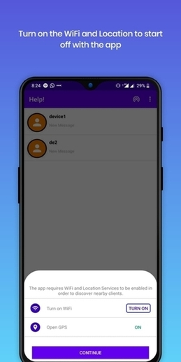
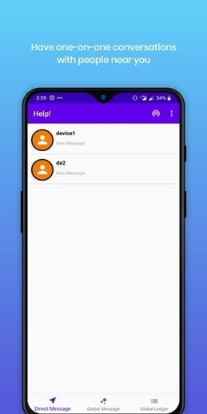
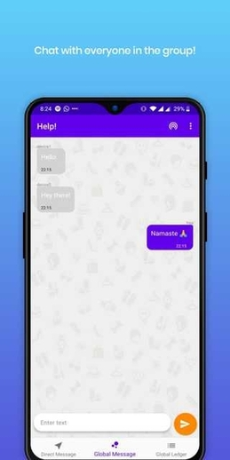
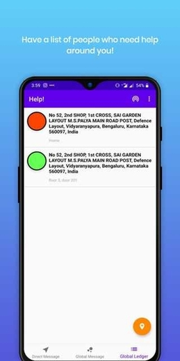
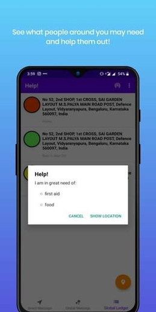
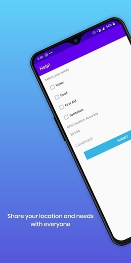
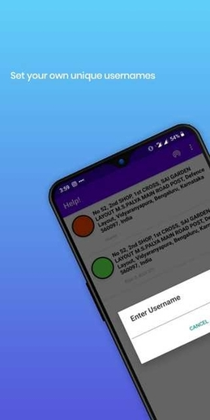

# HelpApp 
HelpApp is our effort towards creating an application which people can use to communicate when there is no internet. This application is created for disaster struck areas where communication can play a vital role in saving human lives but it can also be used in various scenarios.
It is a android chatting app which creates a mesh network of mobiles. Mobiles can interact with each other without connecting  to the internet.
Help was created using Kotlin as its base language with a little Java for the database code.

## Screenshots 

## Build Instructions

This is a standard Android Studio project. To build this project, clone the project in your local machine and open it with Android Studio as an Android project.
And it should build the project (you need to have the right android SDKs). Try invalidating caches and restart if you run into problems on your first build.

## Contribution

### Creating your own flavour
If you want to create your own flavour of Help you are free to do so our app is released under GPL license v3.0.

### I want to help fix bugs
Send in an issue and ask which bug you would want to fix. You could also contact anirudhmv.16cs@saividya.ac.in or yashd.16cs@saividya.ac.in to get the details for contributing to this project. 

## How to use?

1. Install our app on an android device then enter your username and register yourself.
2. Click the connect button on the top and wait for other devices to connect to your device.
3. Texting:
	- Click on Direct Message to send a message to a particular device on your network.
	- Click on Global Message to send a message to all the devices on your network.
4. Sending your location and your requirements:
	- Click on Global Ledger
	- Select the essentials
	- Click on the Submit button.

